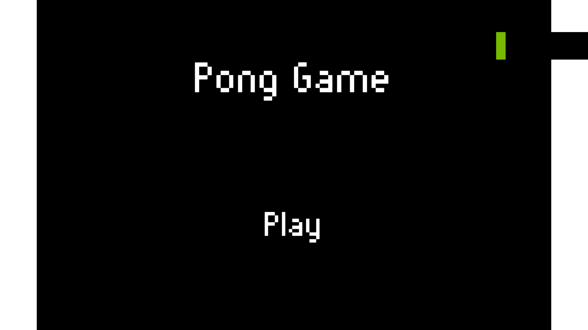
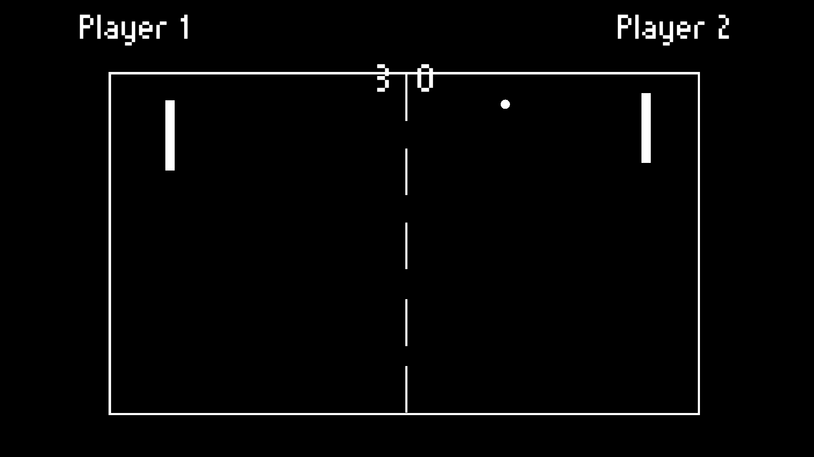

<!-- GAME PROJECT TITLE -->
# Pong---Game
Game created for study purposes by Matheus Soares Martins, and is based off in the original game manufactered by Atari that was released in 1972.

Pong was one of the earliest arcade video games, and was created by Allan Alcorn.
For more information about the original game check: https://en.wikipedia.org/wiki/Pong
 

This game was made to be player by two different players in the same keyboard, but if  you want to play alone you can press F1 and the AI will control the player 2 so you can play alone as player 1.
 

Game Controls 
- Player 1:  
Arrow Up - Goes up 
Arrow Down - Goes down 

- Player 2:  
W - Goes up. 
S - Goes down. 

- Other controls: 
Esc - Closes the game 
F11 - Toggle between fullscreen and windowed mode. 
F1 - Activate/Deactivate the AI control for player 2. 

 

# Screenshots
<!-- GAME PROJECT IMAGES -->

<!-- GAME PROJECT BUIDS -->
# Game download 
## Windows:  https://mega.nz/folder/VVV3ELRQ#10tkFB8d-KmT_2_RAT07vQ
## Mac:  https://mega.nz/folder/xINX1azS#YFEhXwf9mhn6bmjcDjXBdg
## Linux:  https://mega.nz/folder/MQlXlDZb#c_HWTrlipeAbVrNgZbWawg
